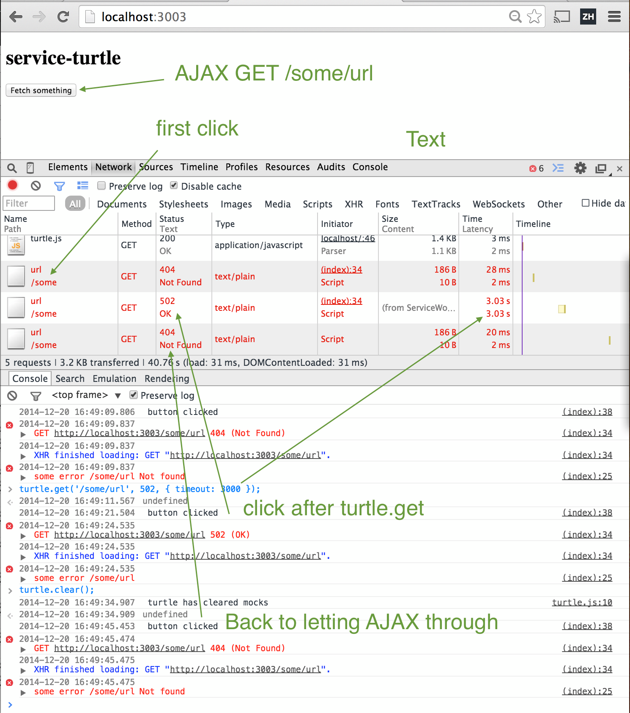

# service-turtle

> HTTP mock in-page proxy using ServiceWorker

Read [Robustness testing using proxies](http://bahmutov.calepin.co/robustness-testing-using-proxies.html).

See [intro to ServiceWorker](http://jakearchibald.com/2014/using-serviceworker-today/) to see how to 
enable ServiceWorker in Chrome today.

    Open chrome://flags/#enable-experimental-web-platform-features in the Chrome browser
    Enable "Enable experimental Web Platform features."
    Restart Chrome

## Install

    bower install service-turtle

Include `turtle.js` in your page. It will call `service-turtle.js` as a service worker.
This will register `turtle` object on the `window` scope. Use `turtle` object methods to add
mock responses for specific urls.

```js
turtle.get(urlRegexString, options);
urlgRegexString - string used to construct RegExp to test against request url
options - response fields
    code - numeric return code for given url (between 200 and 599)
    timeout (ms) - return mock code after waiting for timeout milliseconds
    body - object to return
```

## Example

Mock all GET requests to `/some/url/` to return 502 error after 3 seconds.
See [index.html](index.html) in this repo as example.

```js
turtle.get('/some/url', { code: 502, timeout: 3000 });
```

Clear all installed mocks

```js
turtle.clear();
```



## Updating service worker code

Service worker JavaScript stays with the browser, and could require reloading the page twice to get the browser
to notice changed code, install it and run on the second reload. You also need to use it with a webserver, not
opening the HTML file from the file system. If reloading the page does not refresh the service worker, or
if you want to step through its code to debug it:

    Open chrome://serviceworker-internals/
    Find the script in the list, something like `Script: http://localhost:3003/service-turtle.js`
    Click `Stop` and then `Unregister` buttons to remove it

These steps will force the page to load the new service worker next time you visit the page.
Then after another reload the service worker will start.

**Note:** service worker script can only be loaded from a safe url: `localhost`, `127.0.0.1` or via `https` protocol. 

## Determin the service worker url

By default, the `turtle.js` script determines the url to the service worker automatically (assuming it is in the
same folder as itself). You can override the service worker url and provide the url using global config

    :::html
    <script>
    var serviceTurtleConfig = {
      serviceScriptUrl: '/path/to/service-turtle.js'
    };
    </script>
    <script src="bower_components/service-turtle/turtle.js"></script>

### Small print

Author: Gleb Bahmutov &copy; 2014

* [@bahmutov](https://twitter.com/bahmutov)
* [glebbahmutov.com](http://glebbahmutov.com)
* [blog](http://bahmutov.calepin.co/)

License: MIT - do anything with the code, but don't blame me if it does not work.

Spread the word: tweet, star on github, etc.

Support: if you find any problems with this module, email / tweet /
[open issue](https://github.com/bahmutov/service-turtle/issues) on Github

## MIT License

The MIT License (MIT)

Copyright (c) 2014 Gleb Bahmutov

Permission is hereby granted, free of charge, to any person obtaining a copy of
this software and associated documentation files (the "Software"), to deal in
the Software without restriction, including without limitation the rights to
use, copy, modify, merge, publish, distribute, sublicense, and/or sell copies of
the Software, and to permit persons to whom the Software is furnished to do so,
subject to the following conditions:

The above copyright notice and this permission notice shall be included in all
copies or substantial portions of the Software.

THE SOFTWARE IS PROVIDED "AS IS", WITHOUT WARRANTY OF ANY KIND, EXPRESS OR
IMPLIED, INCLUDING BUT NOT LIMITED TO THE WARRANTIES OF MERCHANTABILITY, FITNESS
FOR A PARTICULAR PURPOSE AND NONINFRINGEMENT. IN NO EVENT SHALL THE AUTHORS OR
COPYRIGHT HOLDERS BE LIABLE FOR ANY CLAIM, DAMAGES OR OTHER LIABILITY, WHETHER
IN AN ACTION OF CONTRACT, TORT OR OTHERWISE, ARISING FROM, OUT OF OR IN
CONNECTION WITH THE SOFTWARE OR THE USE OR OTHER DEALINGS IN THE SOFTWARE.
